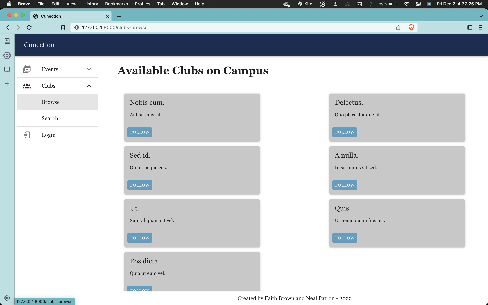
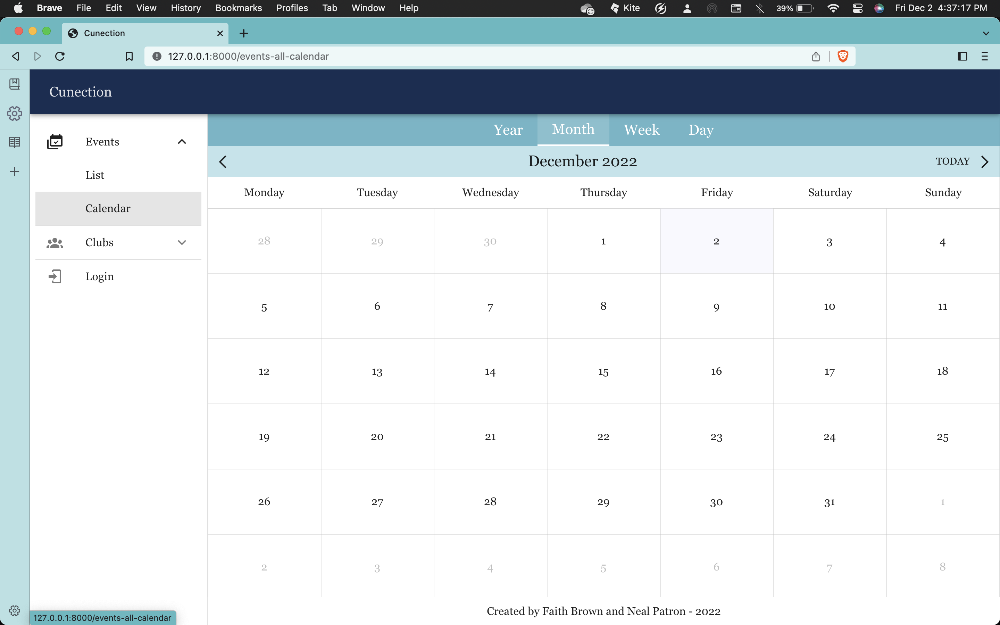
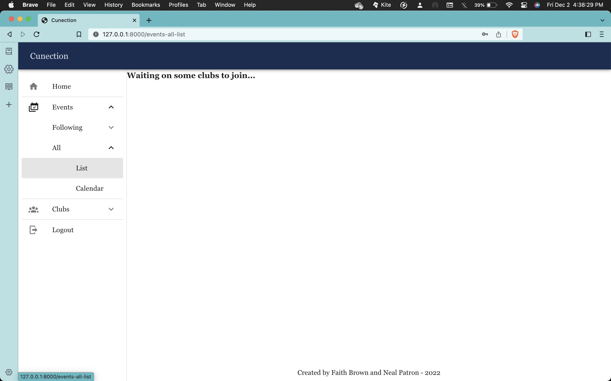
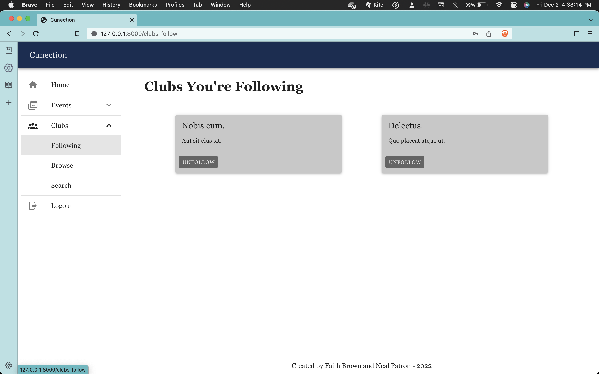
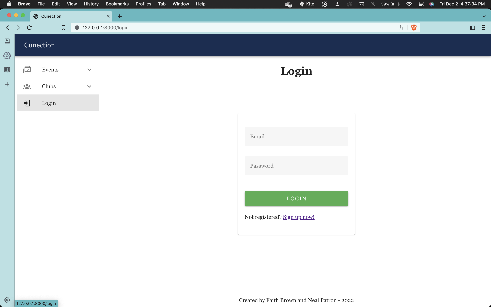

# Cunection - A Web Application to Connect Clubs

---

## Overview
### Purpose
This is a website, called Cunection (pronounced just like "connection"), built originally as a Senior Project in the fall of 2022. It is intended to continue on, hopefully into production.

Cunection is a website for clubs, specifically on the CUNE Campus in Seward, NE. Of course, it is not limited to only that campus. It was built to connect students with clubs and club events, along with giving club admins a platform to reach out to students. We want to increase both club participation and club outreach on campus. 

We hope to pass this project on to the Programming Team at CUNE for further development in the future. 

### Description
#### Frontend

#### Backend
##### API and Models
The API uses the ORM (object-relational mapping) included with Laravel called Eloquent, which allows you to interact with each database table using its corresponding model. Eloquent also allows you to define relationships between models, such as One-to-One and One-to-Many relationships. Many-to-Many relationships require a third table, known as a ‘pivot’ table. Eloquent will automatically handle interactions with this table for you when you define a Many-to-Many relationship. The models we are currently using are *User* and *Club*. *User* and *Club* have a Many-to-Many relationship because a user can follow many clubs, and a club can have many users that follow it.

##### Controllers
We define the API endpoints using three controllers: *UserController*, *ClubController*, and *FollowerController*. The *UserController* handles user registration and login/logout. The *ClubController* currently handles retrieving club info. In the future, this is where you could handle things like editing club info. The *FollowerController* currently handles retrieving the clubs that are followed by a given user. In the future, this is where you could handle retrieving the users that follow a given club. We assign these endpoints to API routes in the *routes/api.php* file

##### Database
We are currently using an SQLite database for this project. The *users*, *password_resets*, *failed_jobs*, and *personal_access_tokens* tables were created as part of the tutorial we followed. The *clubs* table stores clubs and their info, while the *club_user* table acts as the pivot table for the Many-to-Many relationship between clubs and users. The *club_user* table also stores a boolean for each club that a user follows that can be used to determine if the user wishes to receive notifications from that club. 

##### Using Migrations
Each table in the database is created using a migration, which the [Laravel documentation](https://laravel.com/docs/7.x/migrations#introduction) describes as “version control for your database.” Migrations allow you to modify and share the schema of your database. If you wanted to modify a database table on a shared project, you simply need to modify the table’s migration and then anyone working on the project can run the migration locally and will be able to use the modified schema. 

##### Tests
Integration tests using PEST for each of the controllers can be found in the tests/Feature/Http/Controllers/API folder. End-to-end browser tests using Laravel Dusk can be found in the tests/Browser/ folder.

### Installing, Compiling, and Running the Project
This project was developed using npm and Laravel. 

After downloading the project, running `npm install` should download all of the necessary dependencies.

You will need to create a .env file at the root of the project and copy the contents of .env.example into it.
You will also need to create a .env.dusk.local at the root of the project and copy the contents of .env.dusk.local.example into it in order to run the Laravel Dusk tests later.

To compile and hot-reload for development, use `npm run dev`. 
To compile and minify for production, use `npm run build`.

To start the Laravel project, run `php artisan serve`.

To run the PEST tests, run `./vendor/bin/pest`.
To run the Laravel Dusk (browser) tests, you first need to start the project using
    `php artisan serve --env=dusk.local`
You can then run the Dusk tests using `php artisan dusk`.

(insert stuff about getting the laravel side to work as well)

### Examples of the Current Website Pages

#### Page to Browse Clubs

#### Calendar Page for events

#### Page to See Events from All Clubs in List Form (not yet done)

#### Page to See Only Clubs User is Following 

#### Login/Register Page

---0

## Collaborators/Credit
Faith Brown and Neal Patron are the heads of this project, as it was their senior project. 

- [Faith's github](https://github.com/boileddragon)
- [Neal's github](https://github.com/nealpatron)

The main tutorial we followed to incorporate [Laravel Sanctum](https://laravel.com/docs/9.x/sanctum) with [Vue 3](https://vuejs.org/) for authentication was from [Shouts.dev](https://shouts.dev/articles/laravel-spa-with-vue3-auth-crud-example#step1).